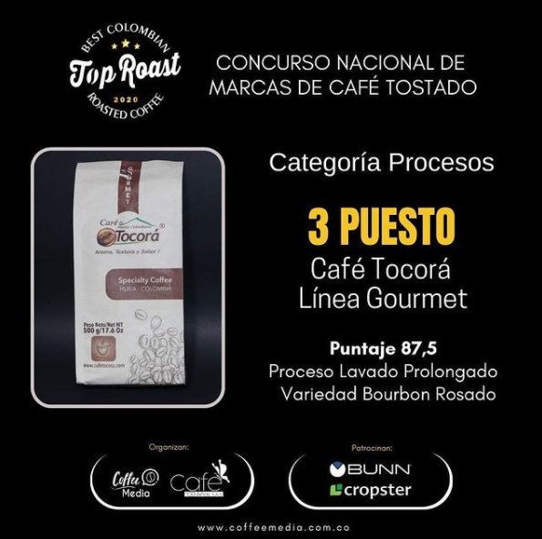

```{r setup, include=FALSE}
library(knitr)
library(rmdformats)


options(max.print="75")
opts_chunk$set(echo=FALSE,
	            cache=TRUE,
               prompt=FALSE,
               tidy=TRUE,
               comment=NA,
               message=FALSE,
               warning=FALSE)
opts_knit$set(width=75)
```


<div style="text-align: justify">

Tocorá es una marca de café originada en San Adolfo, Huila dedicada a la producción, comercialización y exportación de café especial colombiano. Fundada hace 4 años por el Dr Wilder Lazo, medico veterinario y amante del café.

<div/>


<center>

```{r,out.width="100%"}

knitr::include_graphics("3.png")

```

</center>


<div style="text-align: justify">

En el año 2020 café Tocorá participo en el **1er concurso nacional de marcas de café tostado** en el cual fueron participes 210 muestras de café de 16 departamentos productores de café: Antioquia, Boyacá, Caldas, Cauca, Cesar, Cundinamarca, **Huila**, Magdalena, Meta, Nariño, Norte de Santander, Quindío, Risaralda, Santander, Tolima y Valle del Cauca.

De los 210 cafés inscritos, 76 pertenecieron a la categoría Tradicionales, 74 a Procesos y 60 a exóticos.

**café Tocorá** en este concurso ocupó los siguientes puesto:

- 3er puesto en la categoria *procesos* con la línea de café [ **Gourmet**]{style="color: brown"} obteniendo una calificación de 87.5 puntos (Proceso lavado prolongado y variedad Bourbon rosado)

<div/>

<center>

```{r, out.width="60%"}



```


</center>

<div style="text-align: justify">

- 6to puesto en la categoría *exóticos* con la linea de café [ **Varietal**]{style="color: green"} obteniendo una calificacion de 87 puntos (proceso de lavado y variedad SL28)


<div/>

<center>

```{r, out.width="60%"}

knitr::include_graphics("varietal.PNG")

```

</center>
