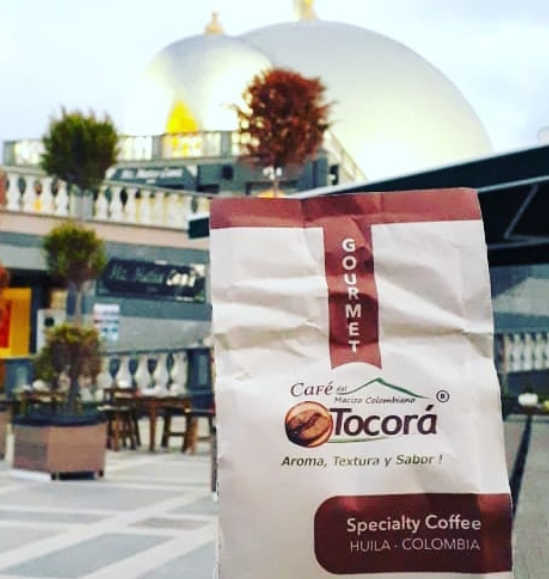
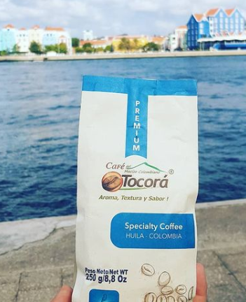
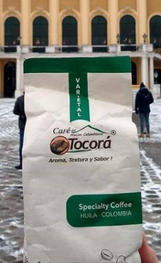
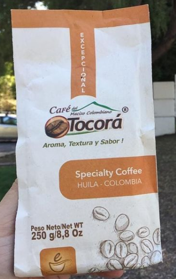

```{r setup, include=FALSE}
library(knitr)
library(rmdformats)


options(max.print="75")
opts_chunk$set(echo=FALSE,
	            cache=TRUE,
               prompt=FALSE,
               tidy=TRUE,
               comment=NA,
               message=FALSE,
               warning=FALSE)
opts_knit$set(width=75)
```


<table border = "5" cellpadding = "5" cellspacing = "2" bordercolor ="white" align ="center">
  <TR>
    <td align ="center"> <H1> Línea </H1> </td>
    <td align ="center"> <H1> Precio </H1> </td>
    <td align ="center"> <H1> Presentación </H1> </td>
  </TR>
  <TR bgcolor = "#FF6666" >
    <TD height ="100%" width = "20%" align ="center" > <H1> [ **Gourmet**]{style="color: brown"} </H1> </TD>
    <TD height ="100%" width = "20%" align ="center"> <H2>  250gr - $16.000
    500gr - $28.000 </H2> </TD>
    <TD height ="100%" width = "20%" align ="center">  </TD>
  </TR>
  <TR bgcolor = "#66CCCC">
    <TD align ="center"> <H2> [ **Premium**]{style="color: blue"} </H2> </TD>
    <TD align ="center"> <H2> $20.000 </H2> </TD>
    <TD align ="center">   </TD>
  </TR>
  <TR bgcolor = "#66FF66">
    <TD align ="center"> <H2> [ **Varietal**]{style="color: green"} </H2> </TD>
    <TD align ="center"> <H2> $26.000 </H2> </TD>
    <TD align ="center">   </TD>
  </TR>
  <TR bgcolor = "#FF6633">
    <TD align ="center"> <H2> [ **Excepcional**]{style="color: orange"} </H2> </TD>
    <TD align ="center"> <H2> $40.000 (agotado) </H2> </TD>
    <TD align ="center">   </TD>
  </TR>
</table>


